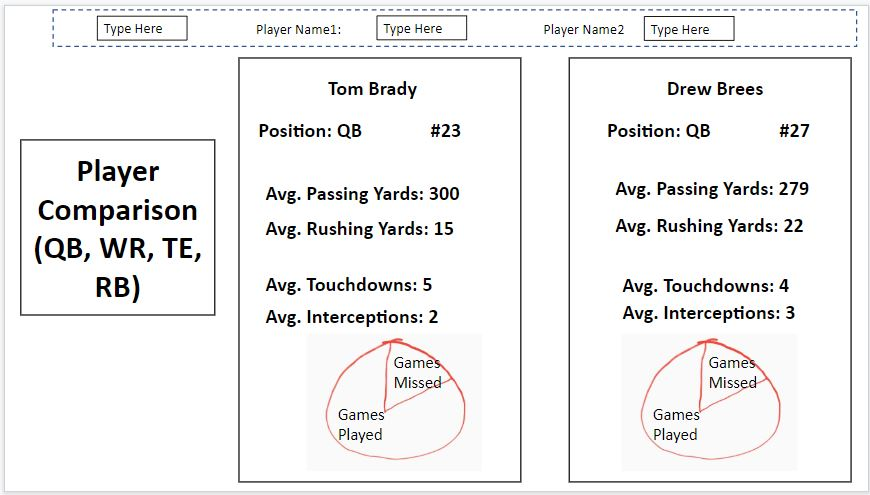
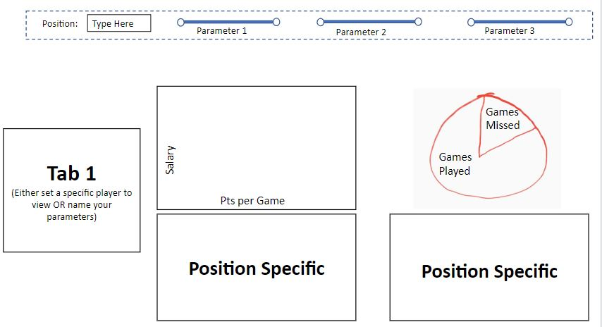
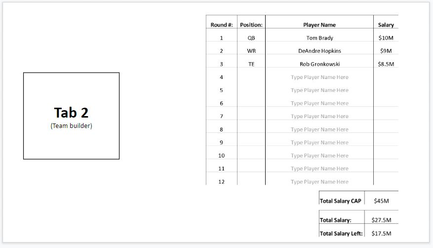
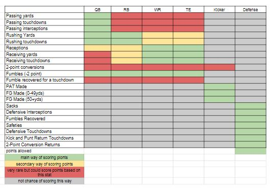

# Fantasy Football Draft Analyzer

### What is fantasy football?

A competition in which participants select imaginary teams made up of players in the NFL and score points according to the actual performance of their players on a week by week basis. Some fantasy league have fees to play and provide prize money to the winners.

### Key Objective

Our key business objective was to create a dashboard that would help fantasy football participants make a more informed decision as to which player to draft for their fantasy team. The initial target was to create a dashboard with 3 tabs that would show the following:

* Tab 1: Provide ability to compare two players of the same positions

    

&nbsp;

* Tab 2: Provide parameters that users could adjust to view the top players that fit those parameters

    

&nbsp;

* Tab 3: Provide a place for users to store the position, name, and salary/purchase price of the players they have drafted

    

&nbsp;

### Data

#### Initially Targeted
* Data on all players, for several previous seasons, and per game
* Fantasy salary / purchase price
* Data sources - Kaggle, Sportsdata.io, Fantasydata.com, and FantasyFootballNerd.com

#### Found and Utilized
* We used data from [Pro Football Reference](https://www.pro-football-reference.com/years/2019/opp.htm)

* NFL stats metrics used for the dashboard

#### Challenges
* The NFL has a large amount of data points given, but needed lots of work to be cleaned
* Different fantasy football leagues use different scoring methods
* Web scraping
* API
    * Free APIs gave limited data
    * Paid APIs were too expensive
* Difficult to find defense by team instead of by player